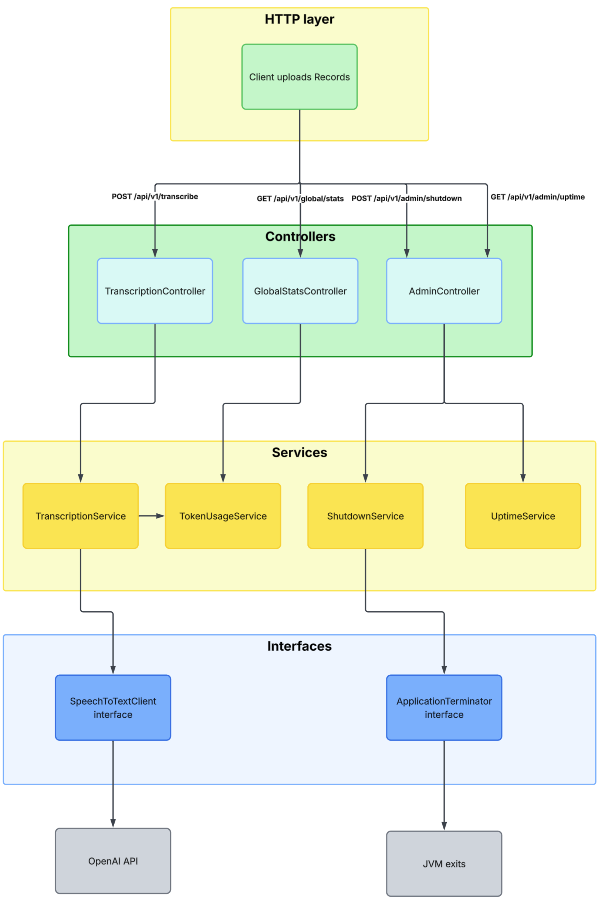
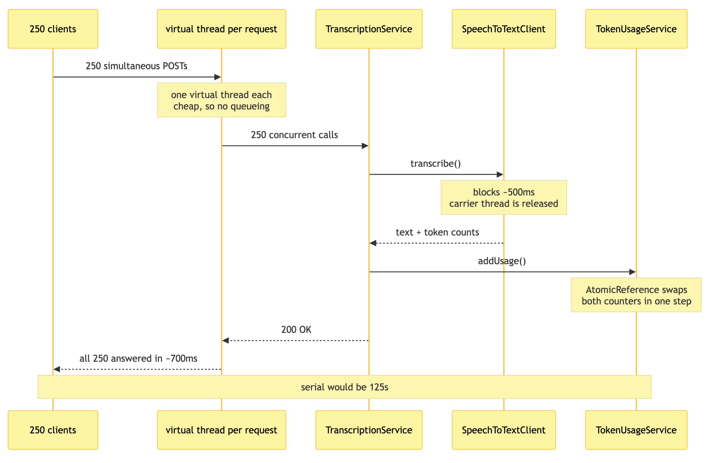

# COMP3011 Assignment 1 - Speech-to-Text API

A Spring Boot service that transcribes recorded audio through OpenAI and reports server lifecycle and token usage through the endpoints defined in `assignment1api.yaml`. Also including a browser client that records from the microphone and displays the transcript.

Java 25, Spring Boot 4.1.1, virtual threads enabled.

## System structure
Requests flow down through controllers into services. The two interfaces at the bottom are the seams: tests swap in a stub speech-to-text client and a no-op terminator, so the whole system can be exercised without a network or an API key.


## Concurrent request handling
Each request blocks for the duration of the speech-to-text call, so virtual threads let 250 of them wait at once without 250 OS threads. Handled one at a time, the same work would take 125 seconds.


## Running it

Needs an OpenAI API key:
```bash
export OPENAI_API_KEY=sk-...
./mvnw spring-boot:run
```

Then open <http://localhost:8080>

### Without an API key

The `stub` profile swaps the OpenAI client for a fake that returns canned text after a short delay. Nothing calls the network, and no key is required:
```bash
./mvnw spring-boot:run -Dspring-boot.run.profiles=stub
```

This is also what the tests run against.

## Endpoints

| Method | Path | Purpose |
|---|---|---|
| `GET` | `/api/v1/admin/uptime` | UTC start time, current time, uptime in seconds |
| `POST` | `/api/v1/admin/shutdown` | Requests graceful shutdown. `202` once, `409` after |
| `GET` | `/api/v1/global/stats` | Cumulative input/output tokens since server start |
| `POST` | `/api/v1/transcribe` | Multipart audio upload, returns the transcript |

The first three are the contract in `assignment1api.yaml`. `/transcribe` is an addition the browser client needs; it is not part of that spec.

Errors always use the spec's `ErrorResponse` shape: `400` for a malformed upload, `413` over the size cap, `415` for a non-multipart body, `502` when the speech-to-text provider fails, `500` for anything unexpected.

## Documentation

| Document | What's in it |
|---|---|
| [docs/ADRs.md](docs/ADRs.md) | Design decisions and why they were made |
| [docs/TESTING.md](docs/TESTING.md) | Why each test exists, and the results |
| [docs/AIUSAGE.md](docs/AIUSAGE.md) | Where AI was used on this assignment |

## Layout

```
client/      speech-to-text providers behind one interface (real + stub)
lifecycle/   application shutdown behind one interface (real + mockable)
controller/  the four HTTP endpoints
service/     application logic: uptime, token counters, shutdown decision
model/dto/   the JSON shapes from assignment1api.yaml
exception/   the error handler and its exception types
static/      the browser client
```

## Tests

```bash
./mvnw test
```

19 tests, covering both the API contract and behaviour under concurrent load.
